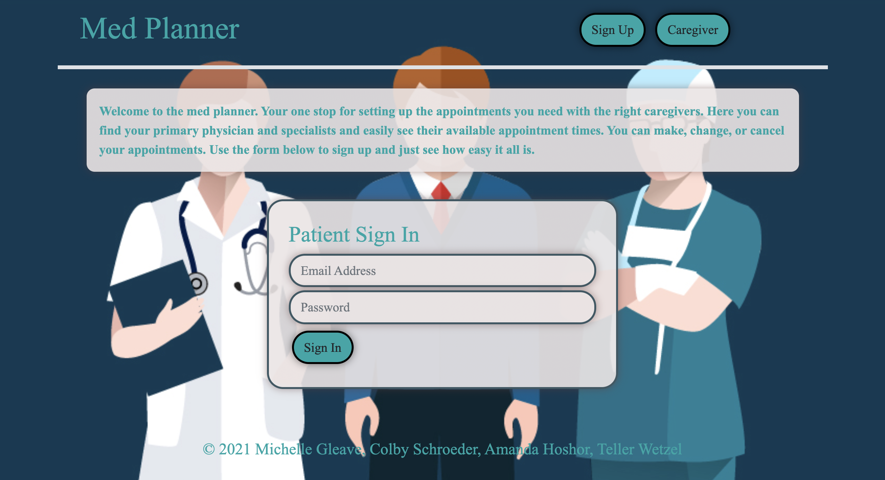
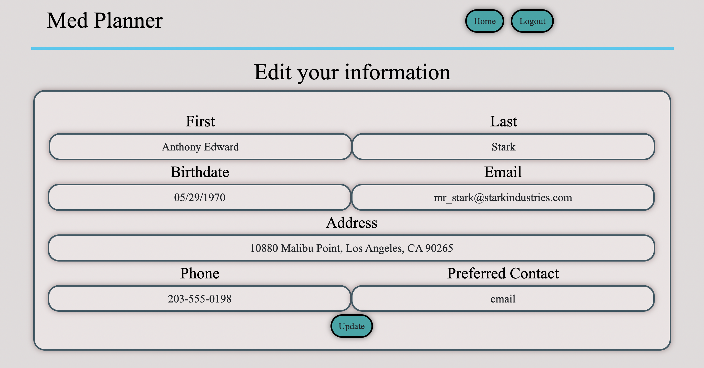
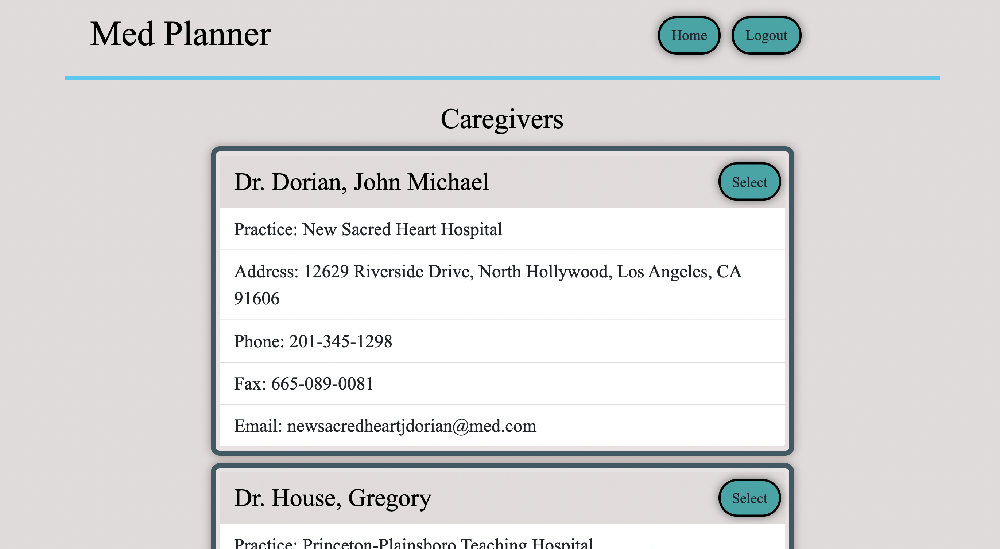
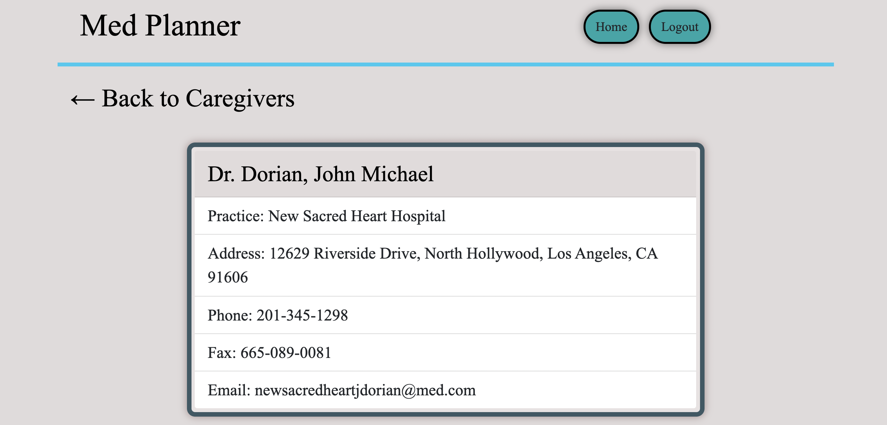
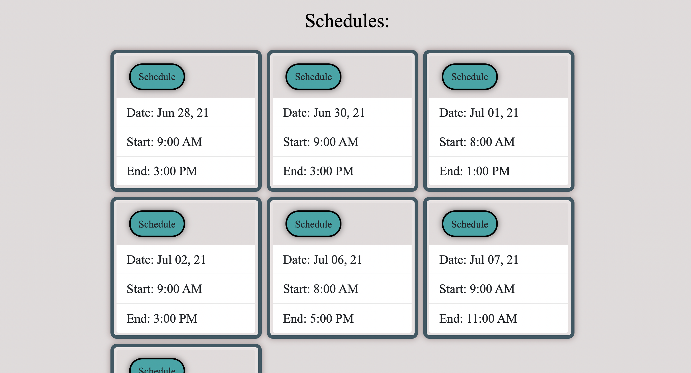
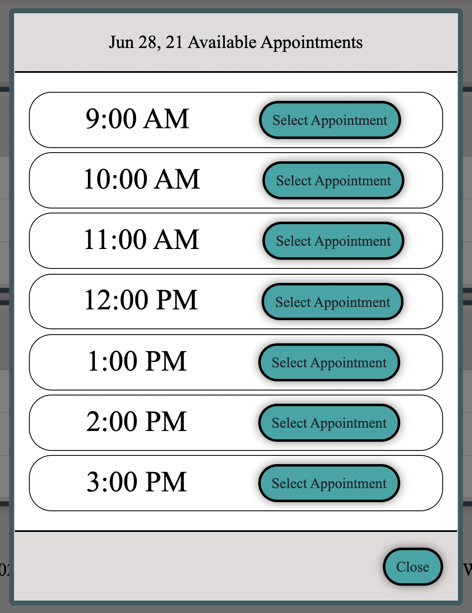
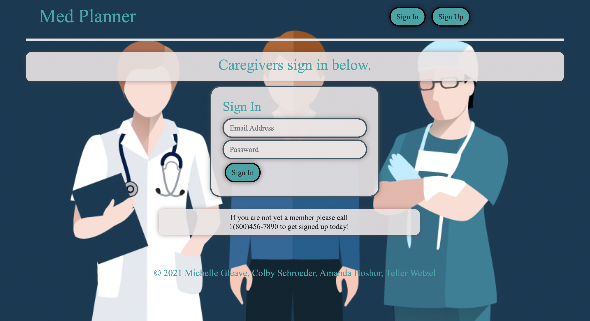
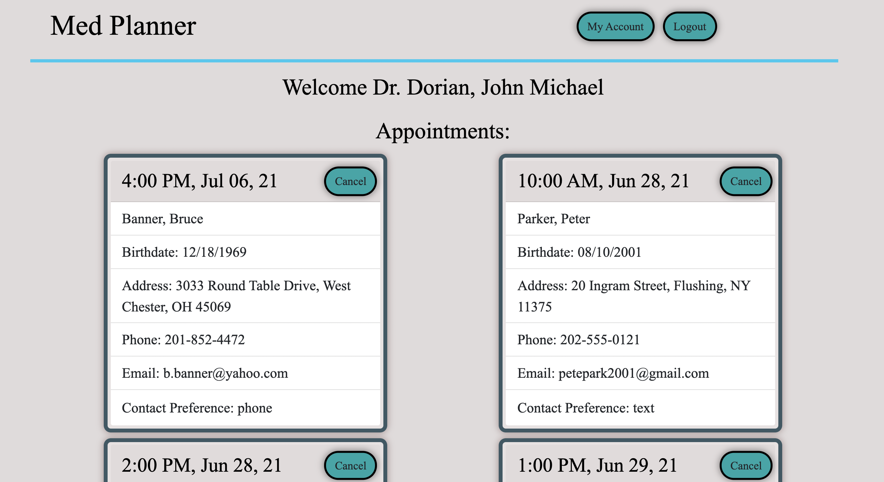
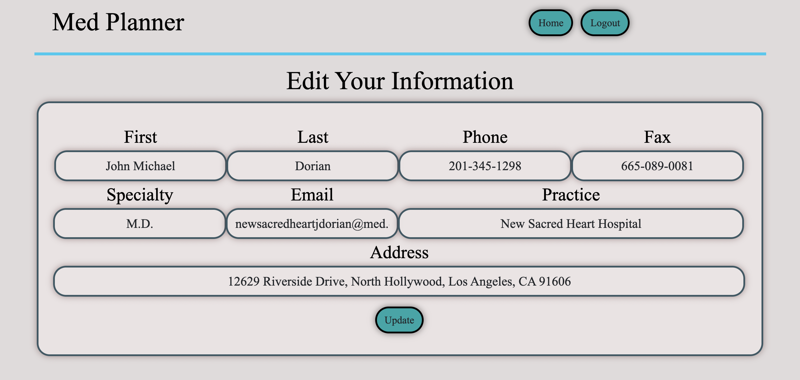
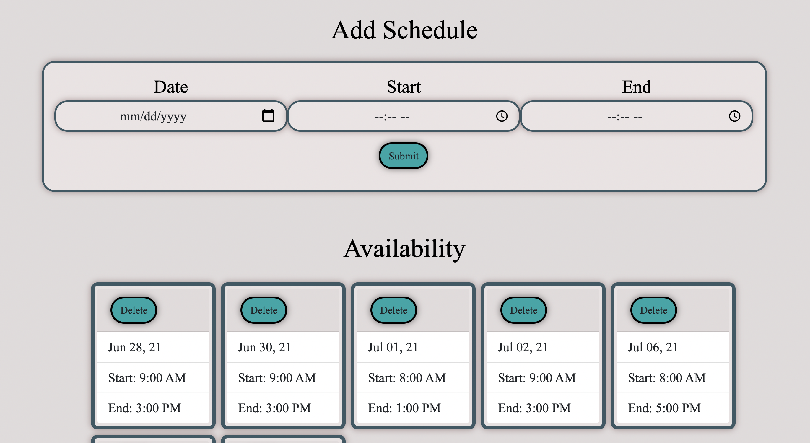

# Med Planner

## Description:
#### _A web application which provides caregivers and patients an easy solution for managing their apointments._

- _[View Project on GitHub](https://github.com/Teller35/med-planner)_
- _[View Project on Heroku](https://med-planner.herokuapp.com/)_
- _[Presentation](https://docs.google.com/presentation/d/10ukbA8G-AE5-ecBF7NZA1cF10yB1OsyFR7uafcZePq8/edit?usp=sharing)_

## Table of Contents:

- [**Usage**](#usage)
- [**Credits**](#credits)
- [**License**](#license)
- [**Questions**](#questions)
- [**Screenshots**](#screenshots)

## Usage

#### _For patient use: visit Heroku site listed below and sign up. For caregiver use, contact the site creators to create an account._

- _[Heroku Link](https://med-planner.herokuapp.com/)_

## Credits

#### _Contributors_

- _[Michelle Gleave](https://github.com/mmgleave/)_
- _[Colby Schroeder](https://github.com/SirUbu/)_
- _[Amanda Hoshor](https://github.com/mandahos/)_
- _[Teller Wetzel](https://github.com/teller35/)_

## License

#### _This project is covered under the isc license!_

#### _[License Link](https://choosealicense.com/licenses/isc)_

## Questions

- #### _If you have any questions please feel free to reach out to me at: <a href='mailto:tellerwetzel@yahoo.com'></i>My Email</a>_
- #### _You can also find more of our work at my GitHub page: [My GitHub](https://github.com/teller35)_

## Screenshots

